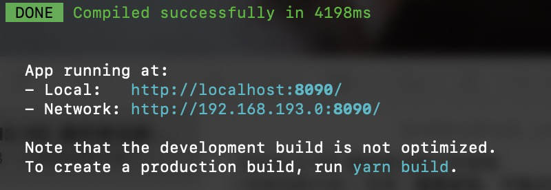
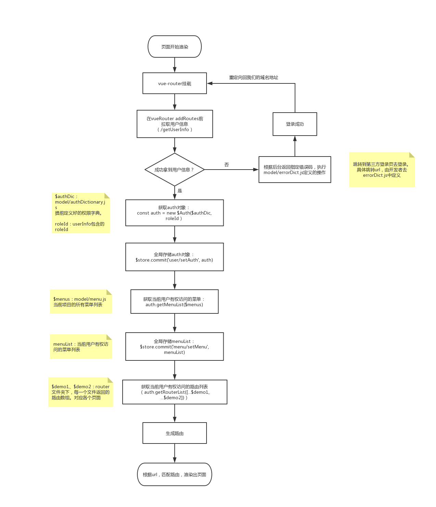
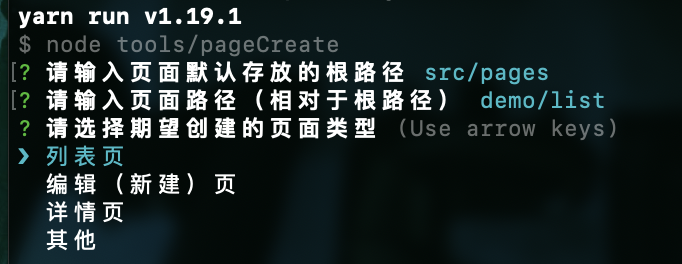
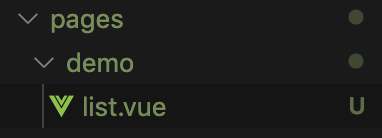
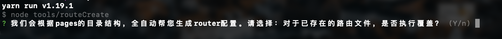

generator-air —— 有态度、有质量、无重量的脚手架生成器。

# 一、设计思想
我们的基本原则：轻量、轻量、轻量。
我们的态度：在保证脚手架轻量、易学习、好上手的基本原则下，尽最大可能为您提供节省开发成本的内置模块以及各种工具，提升开发效率。
我们的愿景：让开发者用最低的学习成本，获取最高的开发效率。
我们的目标：确保为您提供的每一款脚手架，都足够精致。
&nbsp;

# 二、快速上手
## 1.安装
```shell
npm install -g generator-air
```
&nbsp;

## 2.使用
任意目录下（如：tmp目录）执行：
```shell
yo air
```
&nbsp;
根据提示，按需选择。
// 配每一步的截图及说明（特别是模板是否覆盖那里）
&nbsp;

## 3.启动测试
进入刚刚创建的项目根目录，执行：
```shell
npm run dev
```
&nbsp;
出现下图，则启动成功：

&nbsp;
启动成功后，浏览器访问 localhost:8090

&nbsp;

# 三、各款脚手架介绍
## · 管理端-vue（已支持）
### 1.技术栈：vue + element-ui
&nbsp;

### 2.启动效果：

&nbsp;

### 3.目录结构：
```javascript
├── babel.config.js
├── config.js   // 项目构建相关配置文件。如cdn上传路径等
├── gulpfile.js
├── package.json
├── public   // 页面模板
|  ├── favicon.ico
|  └── index.html
├── src   // 源代码
|  ├── App.vue          // 根组件
|  ├── assets             // 静态资源文件夹（图片、icon、css）
|  ├── components    // 自定义组件
|  |  ├── global         // 全局用组件（logo、svgIcon等）
|  |  ├── list             // 列表页用组件（table、pagination、search、filter）
|  |  └── nav           // 布局用组件（navHead、navSide）
|  ├── main.js   // 主入口
|  ├── mixin      // 自定义的一些插件，为Vue增加全局/原型方法
|  ├── model     // 用于存放一些字典类的文件
|  ├── pages      // 页面管理
|  ├── router     // 路由配置
|  ├── util         // 存放项目逻辑用的工具方法
|  └── vuex      // vuex使用demo
├── tools          // 用于项目创建的工具方法（命令行使用的方法。为提高开发者开发效率提供）
|  ├── answersStore.js
|  ├── pageCreate.js   // 页面创建工具（yarn page）
|  └── routeCreate.js   // 路由创建工具（yarn route）
├── vue.config.js
└── yarn.lock
```
&nbsp;

### 4.快速开始
#### 4.1 菜单定义（model/menu.js。命名空间的设计规则）
#### 4.2 页面创建（pageCreate。默认文件夹结构的设计）
#### 4.3 路由生成（routeCreate）
#### 4.4 权限字典（model/authDict）
#### 4.5 api.js 接口定义（model/api.js）
#### 4.6 权限控制（router/index.js + 页面操作控制）
#### 4.7 登录逻辑（区分第三方登录/本系统登录。errorDict.js配置/导航守卫）
#### 4.8 请求错误码字典（errorDict）配置
#### 4.9 启动日志监控（让兴哥写）
#### 4.10 启动开发（yarn dev）
#### 4.11 启动联调（yarn debug + debug ip/域名配置）
#### 4.12 项目部署
（1）cdn 信息配置
（2）打包（yarn build）
（3）静态资源上传（yarn upload）
（4）执行部署（scp xxx）

&nbsp;

### 5.功能模块详解（// 功能、设计思想介绍 + 使用方式详述）
#### 5.1 用户权限
##### 5.1.1 第三方登录场景
（1）整体流程

&nbsp;

（2）用户信息管理
用户信息存放于vuex中（vuex/user.js如下）：
```javascript
export default {
	state: {
		userInfo: null,
		auth: null
	},
	mutations: {
		setUserInfo (state, info) {
			state.userInfo = info
		},
		setAuth (state, authObj) {
			state.auth = authObj
		}
	}
}
```
&nbsp;

（3）权限管理
**【实现方案】**
使用 authority-filter 工具包，进行菜单、路由、页面操作，三个维度的权限控制。
&nbsp;
**【实现代码】**
```javascript
// router/index.js
import $Auth from 'authority-filter'
import $authDic from '../model/authDict'
import $demo1 from './demo1'
import $demo2 from './demo2'
import $demo3 from './demo3'
import $allMenus from '../model/menu'

// $authDic 是需要开发者自行定义的权限字典。roleId 是从 userInfo 中获取的用户角色 id
const auth = new $Auth($authDic, roleId)
// 全局存储 auth 对象（我们建议这样做。如果有页面操作权限控制需求，那么必须这样做）
$store.commit('user/setAuth', auth)
// 进行路由过滤（传入项目定义的所有路由。详见 5.2）
const routerList = auth.getRouterList([...$demo1, ...$demo2, ...$demo3])
// 生成当前用户有权访问的路由配置。其中，'/' '/home' '*' 为默认路由配置，所有用户皆有权限访问
router.addRoutes([
	...routerList,
	{
		path: '/',
		redirect: '/home'
	},
	{
		path: '/home',
		component: $home
	},
	{
		path: '*',
		component: $notFound
	}
])
// 进行菜单过滤（传入项目定义的所有菜单。详见 5.2）
const menuList = auth.getMenuList(allMenus)
// 全局存储 menuList（这里全局存储，在生成菜单时，就可以通过vuex访问到menuList数据）
$store.commit('menu/setMenu', menuList)

```
关于 authority-filter 的详细说明，请参照：[authority-filter](https://www.npmjs.com/package/authority-filter "authority-filter")
&nbsp;

#####  5.1.2 本系统登录场景（开发完善中）
（1）整体流程
（2）用户信息管理
（3）权限管理

#### 5.2 菜单&路由&页面
##### 5.2.1 菜单的设计
定义位置：model/menu.js 👇
```javascript
const menus = [
	{
		title: '操作过滤',
		icon: 'clock',
		url: '/demo1'
	},
	{
		title: '工具示例',
		icon: 'gear',
		submenu: [
			{
				title: '使用示例',
				url: '/demo2'
			}
		]
	},
	{
		title: '组件示例',
		icon: 'clock',
		submenu: [
			{
				title: '数据管理',
				icon: 'clock',
				submenu: [
					{
						title: '数据列表',
						url: '/demo3'
					}
				]
			}
		]
	},
]

export default menus

```
###### 【注意】
根据我们的设计，**菜单的 url，应该只有一层**。即：定义为/demo，而非/demo/list。
**这一层，作为一个命名空间。它之下的所有路径，对应这个菜单下的二级、三级...n级页面。**
比如，/demo 是一个菜单页，类型为列表页。包含编辑、详情按钮。从这个入口进入的编辑、详情页，对应的路由，应该形如：/demo/edit、/demo/detail。
这样，我们就可以根据路由的“命名空间”，确定菜单栏中的哪一个菜单，显示为高亮选中。
&nbsp;

##### 5.2.2 路由的设计
项目中所有路由，统一放在 router 文件夹下。
router下的每一个路由文件，**与菜单页一一对应**。也就是，**与命名空间一一对应**。
每一个路由文件内，定义当前菜单页、以及它下属的二级、三级......n级页面的所有路由。
在入口文件 router/index.js 中，引入 vue-router，和所有的路由文件。同时，根据当前登录用户权限，动态生成可访问的路由文件。
例如：
有菜单页/demo1，命名空间为demo1，则应有一个router/demo1.js，内容形如：
```javascript
const pages_demo1_detail = () => import('pages/demo1/detail.vue')
const pages_demo1_edit = () => import('pages/demo1/edit.vue')
const pages_demo1_list = () => import('pages/demo1/list.vue')

const routerList = [
	{
		path: '/demo1/detail',
		component: pages_demo1_detail
	},
	{
		path: '/demo1/edit',
		component: pages_demo1_edit
	},
	{
		path: '/demo1',
		component: pages_demo1_list
	}
]

export default routerList

```
&nbsp;

##### 5.2.3 页面的管理
所有页面，统一存放在 pages 文件夹下。
按照我们的设计，**pages 下的每一个文件夹，对应一个菜单页**，内部存放菜单页.vue文件，和它下属的所有二级、三级......n级页面。那些既不是菜单页，又不是菜单页下属页面的页面，如 home 页、notFound 页，直接存放在 pages 下。

**这里需要注意：菜单页对应的页面，我们规定命名为 index.vue / list.vue。**

如果你的 pages 目录结构，遵从我们的规范，当你使用我们提供的 yarn route 命令，我们会为你全自动生成 router 文件夹下的所有路由文件。

当然，这里的规范要求，目前只有两点：
（1）pages 下的每一个文件夹，要对应一个菜单页。这个文件夹的名字，会成为菜单页的路由，也就是命名空间。
（2）菜单页对应页面的命名，只能是 index.vue / list.vue。

除此之外，你可以完全按照自己的意愿，去管理页面。
**请注意，我们只会生成不直接存放于 pages 下的页面对应的路由文件。**

那些直接放在 pages 下的页面，如 home.vue，我们选择在 router/index.js 中手动配置。
一来，因为这样的页面并不会太多。二来，这样的页面，通常不存在访问权限的问题，所有人皆可访问，不需要参与路由过滤。同时，如匹配'*'的notFound页，是有定义顺序要求的，一定要放到路由定义的最后，才可以防止错误匹配与跳转。因此，更适合手动管理。
&nbsp;

#### 5.3 接口调用 —— mixin/request.js
##### 5.3.1 使用demo
```html
<!-- list.vue -->
<template>
	我是列表页
</template>

<srcipt>
export default {
	data() {
		return {
			list: ''
		}
	},
	mounted() {
		this.$get('/getList', { age: 25 }).then(res => {
			console.log('res:', res)
			this.setData()
		})
	}
}
</srcipt>
```
&nbsp;

##### 5.3.2 支持功能
| 方法 | 调用方式 |
| ------------ | ------------ |
| $get | this.$get(url, params).then(rs => console.log('res:', res)) |
| $post | this.$post(url, params).then(rs => console.log('res:', res))|
| $put | this.$put(url, params).then(rs => console.log('res:', res))|
| $delete | this.$delete(url, params).then(rs => console.log('res:', res))|
| $request | this.$request({ method: 'get', params: { test: 100 } }).then(rs => console.log('res:', res))|

【注】
所有方法，均支持在.vue中直接使用this调用。
如果需要在js中使用，手动import即可。import { $get, $request } from '@/mixin/request'
&nbsp;

##### 5.3.3 请求错误处理
对于请求错误的处理，我们设计了错误字典：model/errorDict.js。

它看起来像这样：
```javascript
export default {
	/** key: httpCode
	 *   value: 指定错误码，对应的前端响应。如果是方法，直接执行。如果是string，弹窗提示
	 */
	403: () => location.href = 'http://mp.weixin.qq.com',
	404: '啊哦，404了',
	200: {
		// key: 服务器定义的code，value：同上
		3000: '服务器返回了一个3000',
		3005: () => location.href = 'https://open.work.weixin.qq.com/wwopen/sso/qrConnect?appid=APPID&agentid=AGENTID&redirect_uri=REDIRECT_URI&'
	}
}

```
开发者可以通过配置 errorDict，指定错误码对应的响应或提示语。

我们在request.js中使用了拦截器，处理errorDict中定义的响应。你可以放心地将所有错误处理，统一配置在这个字典中。除此之外，只专注于数据正确响应的逻辑开发即可。
&nbsp;

#### 5.4 日志监控模块

#### 简介

Aegis是腾讯开源的一站式前端监控解决方案，涵盖了日志上报，错误监控，性能监控，资源测速等功能。
主要提供基础数据的上报，支持无打点首屏测速、无侵入式资源测速、CGI测速、白名单机制、离线日志等先进特性。
通过自动监控前端错误，在错误发生时上报错误的具体情况，协助开发者快速定位问题。

#### 优势
- 完全基于 Node 的海量数据处理中间件，针对海量数据进行多维度的分析，对于前端开发者十分友好。

- 调用方便，只需在全局初始化aegis实例，将会监听所有的 API 请求，并把响应内容全量上报至后端服务

- 在使用 aegis 时无需在业务代码中打点或者做任何其他操作，可以做到与业务代码充分解耦。

- 当开启资源测速时，aegis 将会自动监听页面资源加载情况（耗费时长、成功率等），并在不影响前端性能的前提下收集前端的性能数据，
快速定位性能短板，提升用户体验。

- 当前版本的aegis的数据采用离线计算的方式。为了提高数据的实效性，将离线计算的事件粒度缩减到分钟级别，能够提供短时的数据，
帮助开发者快速响应问题。另外，也提供按天的统计数据，帮助开发者把控大盘，掌握全局视角。

  

- 目前 aegis 平均每天为用户处理约8千万次pv事件和8千万条日志以及1亿多条测速数据。单机 TPS 为 5K 左右，服务器支持弹性扩容，
即使业务扩张也可以维持良好的鲁棒性。

- Aegis 目前提供包括监控、告警、日报、报表、白名单配置、数据查询等开发者服务，与企业微信、邮件系统打通，提供及时、快速的消息反馈。
同时提供aegis开发者平台(https://aegis.ivweb.io)，是专为开发者设计的一站式项目周期管理、项目监控平台，在此完成项目申请并接入前端SDK之后，
即可快速查看相关项目数据信息。平台从开发者角度出发，聚焦于发现问题和提高效率，用顺应直觉的交互及直观的图表，
帮助开发者洞悉存在于数据背后的未知。

##### 5.4.1 使用demo

###### 初始化

打开全局开关

在config.js中配置

```
config.logReport = true
```

初始化aegis实例

```javascript
const aegis = new Aegis({
    id: 0, // 在 aegis.ivweb.io 申请到的 项目id
    reportApiSpeed: true,
    reportAssetSpeed: true
})
```
将reportApiSpeed和reportAssetSpeed配置为true时，Aegis 将会自动收集页面的API、静态资源请求状况，并上报至 Aegis 后端服务。


##### 5.4.2 分级上报

###### info级别上报 
```javascript
this.$aegis.logI('aegis普通日志上报', report)
```
上报info 等级的日志，不会影响 Aegis 评分，也不会触发 Aegis 告警。非常适合上报关键路径信息，当问题发生时，可以配合快速定位复现路径。 

###### error级别上报 
```javascript
this.$aegis.logE('aegis异常日志上报', report)									
```
上报error等级的日志，往往意味着页面出现了错误，当上报的 error 日志达到阈值时，Aegis 将会进行告警，帮助开发者尽早发现问题。另外，Aegis 每天都会给所有项目打分，上报的 error 日志数量是一个关键指标。

###### 上报测速日志
```javascript
this.$aegis.report('www.test.com', report)									
```

上报测速日志,其中www.test.com替换成项目中需要上报的链接


##### 5.4.3 能力扩展
更多信息，可阅读aegis官网：[http://aegis.oa.com/](http://aegis.oa.com/ "http://aegis.oa.com")
&nbsp;

#### 5.5 前后端分离 —— mock支持
我们提供了，使用在线mock/本地mock，两种mock方式，你可以按需选择。

开始使用前，请在 config.js 中设置 config.mock = '在线mock域名地址/127.0.0.1:3001'。
（我们提供的本地mock，默认启动在3001端口）
&nbsp;

##### 5.5.1 在线mock
【配置Demo】
```javascript
// config.js
config.mock = 'https://www.fastmock.site/mock/5804566cbf92cb32bf29b622fdfe6138/word'
```
我们以使用 fastmock 为例，mock了脚手架的demo数据。
fastmock 官网传送门：[https://www.fastmock.site](https://www.fastmock.site/#/ "https://www.fastmock.site/#/")
&nbsp;

##### 5.5.2 本地mock
【配置Demo】
```javascript
// config.js
config.mock = 'http://127.0.0.1:3001'
```
【说明】
本地mock，使用json-server。

【mock目录结构】
```javascript
├── data                    // 存放mock数据
|  ├── fail                  // 模拟调用失败的mock数据
|  |  └── demo1
|  |     ├── edit.json
|  |     └── list.json
|  └── success           // 模拟调用成功的mock数据
|     └── demo1
|        ├── edit.json
|        └── list.json
├── db.js                    // 用于生成mock数据结构
├── mock-server.js      // 服务启动入口
```

【使用方式】

**step1：根据接口 url 层级，创建 mock 用 json 文件**
例如：接口 url 为 /demo1/list
创建模拟请求成功的mock文件：/mock/data/success**/demo1/list.json**
创建模拟请求失败的mock文件：/mock/data/fail**/demo1/list.json**

**step2：统一在 api.js 进行接口配置**
模拟请求成功，直接使用真实接口：const API = { list: '/demo1/list' }
模拟请求失败，改造真实接口为：const API = { list: '**/fail**/demo1/list' }

**step3：页面中使用真实的接口请求逻辑**
```javascript
import $api from '@/model/api.js'
this.$get($api.list).then(res => { console.log('res:', res) })
```
&nbsp;

关于json-server的具体设计方案，详见：[https://www.jianshu.com/p/2b18352b49d1](https://www.jianshu.com/p/2b18352b49d1 "https://www.jianshu.com/p/2b18352b49d1")
&nbsp;

#### 5.6 实用工具
##### 5.6.1 页面创建：pageCreate
【使用方式】
```shell
yarn page
```

&nbsp;

效果如图：

&nbsp;

##### 5.6.2 路由自动生成：routeCreate
【使用方式】
```shell
yarn route
```



我们支持全覆盖式路由创建、附加式路由创建，两种选择。
&nbsp;

#### 5.7 静态资源管理（本地图片、svg、css管理、打包后代码上传腾讯云cos）

#### 5.8 开发支持
（1）接口管理（api.js）
（2）本地联调跨域解决 —— proxy代理方案+内网代理agent配置
（3）命令行启动，模式区分设计
#### 5.9 规范代码
（1）.eslintrc 与 .editorconfig
（2）pre-commit 检查
## · 管理端-react（开发中）
## · 小程序-原生（开发中）
## · 小程序-taro（开发中）
## · 小程序-wepy（开发中）
## · 移动端-vue（开发中）
## · 移动端-react（开发中）
## · NodeJS-koa（开发中）
## · NodeJS-express（开发中）
## · 组件工具-原生js（开发中）
## · 组件工具-vue组件（开发中）
## · 组件工具-react组件（开发中）
