generator-air —— 有态度、有质量、无重量的脚手架生成器。

[TOC]

# 一、设计思想

我们的基本原则：轻量、轻量、轻量。
我们的态度：在保证脚手架轻量、易学习、好上手的基本原则下，尽最大可能为您提供节省开发成本的内置模块以及各种工具，提升开发效率。
我们的愿景：让开发者用最低的学习成本，获取最高的开发效率。
我们的目标：确保为您提供的每一款脚手架，都足够精致。

<br>

# 二、快速上手

## 1.安装

```shell
npm install -g yo
```

```shell
npm install -g generator-air
```

<br>

## 2.使用

任意目录下（如：tmp目录）执行：

```shell
yo air
```

<br>

根据提示，按需选择。

<br>

## 3.启动测试

进入刚刚创建的项目根目录，执行：

```shell
npm run dev
```

<br>

出现下图，则启动成功：

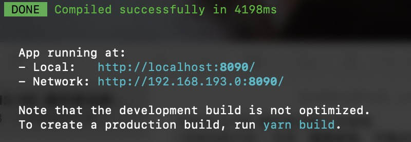

<br>

启动成功后，浏览器访问 localhost:8090

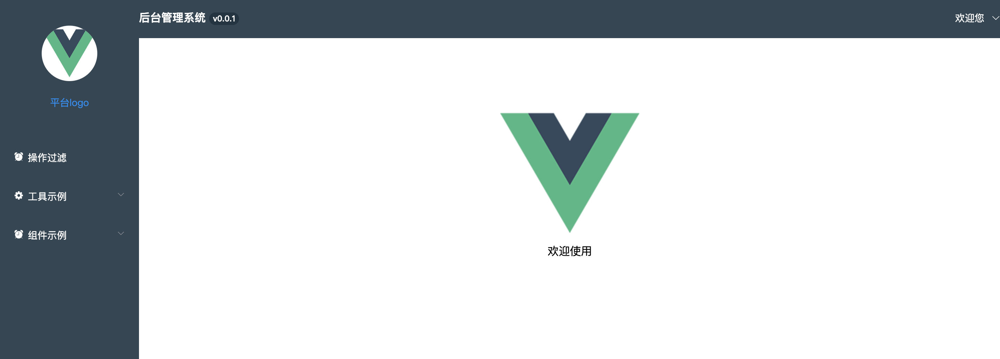

<br>

# 三、各款脚手架介绍

## · 管理端-vue（已支持）

### 1.技术栈：vue + element-ui

<br>

### 2.启动效果：


<br>

### 3.目录结构：

```javascript
├── babel.config.js
├── config.js   // 项目构建相关配置文件。如cdn上传路径等
├── gulpfile.js
├── package.json
├── public   // 页面模板
|  ├── favicon.ico
|  └── index.html
├── src   // 源代码
|  ├── App.vue          // 根组件
|  ├── assets             // 静态资源文件夹（图片、icon、css）
|  ├── components    // 自定义组件
|  |  ├── global         // 全局用组件（logo、svgIcon等）
|  |  ├── list             // 列表页用组件（table、pagination、search、filter）
|  |  └── nav           // 布局用组件（navHead、navSide）
|  ├── main.js   // 主入口
|  ├── mixin      // 自定义的一些插件，为Vue增加全局/原型方法
|  ├── model     // 用于存放一些字典类的文件
|  ├── pages      // 页面管理
|  ├── router     // 路由配置
|  ├── util         // 存放项目逻辑用的工具方法
|  └── vuex      // vuex使用demo
├── tools          // 用于项目创建的工具方法（命令行使用的方法。为提高开发者开发效率提供）
|  ├── answersStore.js
|  ├── pageCreate.js   // 页面创建工具（yarn page）
|  └── routeCreate.js   // 路由创建工具（yarn route）
├── vue.config.js
└── yarn.lock
```

<br>

### 4.快速开始
#### 4.1 页面创建

```shell
yarn page
```

按需选择：

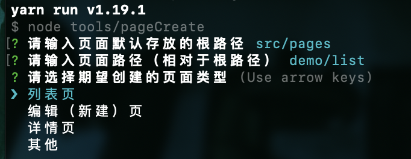

执行生成后，效果如下：

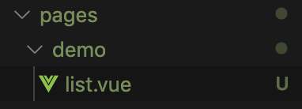

<br>

**【注意点】**

**我们要求，所有一级页面的组件名称，保持一致。**
也就是说，所有菜单栏对应页面的组件名称，需要保持一致。
比如，我们统一将一级页面名称定为list（因为大部分的一级页面，是列表页）。
这时，我们来创建一个菜单页：
页面路径应该输入：demo1/list
再来创建下一个菜单页：
页面路径应该输入：demo2/list 或 demo3/article/list
在这个例子里，无论一级页面组件的创建目录是什么，它的名字，必须要是 list

如果这个菜单页上存在“编辑”“详情”按钮，也就是，存在二级页面入口。
那么，在创建它下属的“编辑”“详情”页时，你应该这样定义页面路径：
demo1/edit、demo1/detail、demo2/edit、demo3/article/edit。

**这是因为，我们将一级页面组件所在的文件夹目录，作为它的路由，同时，也作为一个命名空间，用于它下属的二级、三级...页面的路由定义。**
**命名空间的设计，主要用于菜单栏的选中态判断。我们要确保，打开菜单栏对应页面下属的二级、三级...页面时，菜单栏依然可以保持选中状态。而不仅仅是打开菜单栏对应的一级页面时，才选中。**

<br>

当你把需要的所有页面都创建完成，就可以执行下一步，愉快地进行路由的自动生成啦~
当然，如果后面还有新增的页面，也可以创建后，再次执行路由的生成哦 😉

<br>

#### 4.2 路由生成

```shell
yarn route
```

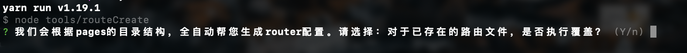

<br>
按照我们当前模拟的场景，这是我们第一次创建路由。因此，选择覆盖/不覆盖，皆可。
执行后，你会得到与 pages 下文件夹一一对应的所有路由文件。也就是，与菜单页一一对应。
<br>

以内置 demo 为例。pages 文件夹结构如下：

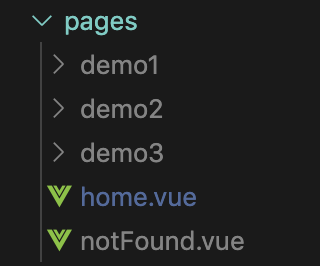

routeCreate 生成的路由文件如下：

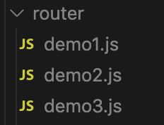

<br>

【注意点】
（1）routeCreate 不会处理直接创建在 pages 下的页面。这些页面的路由，需要开发者在 router/index.js 中手动定义。如内置的 home.vue、notFound.vue 页面。

（2）routeCreate 会提示您输入一级页面组件名。它指的是，菜单栏对应页面的名称。在 4.1 页面创建 的例子中，这个名称，就是 list。

<br>
** 如果你不想使用我们的 routeCreate，而选择手动创建路由，那么你需要遵循以下两点规范：
（1）菜单页的路由，定义为一个命名空间。比如：/demo，当然，也可以是 /demo/index。
（2）菜单页的下级页面路由，在这个命名空间下追加。比如：二级页面 /demo/edit，三级页面 /demo/edit/preview。或二级页面 /demo/index/edit，三级页面 /demo/index/edit/preview **

<br>

#### 4.3 菜单定义

```javascript
// model/menu.js —— 根据如下内置示例，配置项目的菜单
const menus = [
	{
		title: '操作过滤',
		icon: 'clock',
		url: '/demo1'
	},
	{
		title: '工具示例',
		icon: 'gear',
		submenu: [
			{
				title: '使用示例',
				url: '/demo2'
			}
		]
	},
	{
		title: '组件示例',
		icon: 'clock',
		submenu: [
			{
				title: '数据管理',
				icon: 'clock',
				submenu: [
					{
						title: '数据列表',
						url: '/demo3'
					}
				]
			}
		]
	},
]

export default menus

```

**【注意点】**

我们已经创建完所有路由，这里，你只需去 router 下的路由文件中，寻找你需要的菜单页路由，并配置在 model/menu.js 中即可。

<br>
#### 4.4 权限字典

定义权限字典（model/authDict）：

```javascript
const dictionary = {
	// 101：角色id（roleId）
	101: [
		{
			path: '/demo1',   // 有权访问的路由
			operations: ['create', 'edit', 'delete']   // 对当前路由有权进行的操作
		},
		{
			path: '/demo2',
			operations: ['create', 'edit']
		},
		{
			path: '/demo3',
			operations: ['create', 'edit', 'delete']
		},
		{
			path: '/demo3/edit',
			operations: ['create', 'edit']
		},
		{
			path: '/demo3/detail',
			operations: ['delete']
		}
	],
	102: [
		{
			path: '/demo1/edit',
			operations: ['edit', 'delete']
		},
		{
			path: '/demo2'
		}
	]
}

export default dictionary;

```

**【注意点】**

（1）roleId 从获取用户信息接口拿到。请自行与后台同学对接确认。
（2）operations 字段可选。如果不需要进行页面操作权限控制，则可以不定义 operations。
（3）operations 数组的字段值，由开发者自行定义

<br>
#### 4.5 api.js 接口定义

model/api.js：

```javascript
// 统一的接口管理
const API = {
	getUserInfo: '/getUserInfo'
}

// 如果是开发模式，为接口路径手动添加dev前缀，用于proxy代理匹配
if (document.domain.indexOf('.com') === -1) {
	Object.keys(API).forEach(key => {
		API[key] = '/dev' + API[key]
	})
}

export default API
```

需要调用的后台接口，统一在 api.js 里定义。并在页面中，通过引用 api.js 进行调用。

<br>
#### 4.6 权限控制

路由与菜单的权限控制逻辑，脚手架已经内置。
因此，对于权限控制，你只需要按需进行页面操作权限的过滤操作即可。
<br>

脚手架内置的权限处理（router/index.js）：

```javascript
import $vue from 'vue'
import $vueRouter from 'vue-router'
import $Auth from 'authority-filter'  // npm 包
import $request from '.mixin/request'
import $authDic from '.model/authDict'
import $demo1 from 'demo1'
import $demo2 from 'demo2'
import $demo3 from 'demo3'
import $allMenus from '.model/menu'
import $store from '.vuex/index'
import $api from '.model/api'

const $home = () => import(/* webpackChunkName: "home" */ 'pages/home')
const $notFound = () => import(/* webpackChunkName: "notFound" */ 'pages/notFound')

$vue.use($vueRouter)

const router = new $vueRouter()

// 拉取用户信息（【Replace】需替换为实际的接口地址）
$request.$get($api.getUserInfo).then(res => {
	if (res && res.data) {
		// 全局存储用户信息
		$store.commit('user/setUserInfo', res.data)
		// 将权限字典 + roleId传入权限组件
		const auth = new $Auth($authDic, res.data.roleId)
		// 全局存储 auth 对象
		$store.commit('user/setAuth', auth)
		// 获取经过权限过滤后的路由
		const routerList = auth.getRouterList([...$demo1, ...$demo2, ...$demo3])
		router.addRoutes([
			...routerList,
			{
				path: '/',
				redirect: '/home'
			},
			{
				path: '/home',
				component: $home
			},
			{
				path: '*',
				component: $notFound
			}
		])
		// 获取经过权限过滤后的菜单
		const menuList = auth.getMenuList($allMenus)
		// 权限过滤后的菜单保存至vuex
		$store.commit('menu/setMenu', menuList)
	}
})
```

<br>
对页面的操作权限进行过滤，请参考 pages/demo1/list.vue：

```html
<template lang="pug">
	.p-page
		.title 页面操作过滤demo
		.buttons
			//- 这里读取的字段，取决于 authDict.js 内的定义
			el-button(v-if="operations.includes('create')") 创建
			el-button(v-if="operations.includes('edit')") 编辑
			el-button(v-if="operations.includes('delete')") 删除
</template>

<script>
import { mapState } from 'vuex'

export default {
	computed: {
		...mapState('user', [
			'auth'
		])
	},
	data() {
		return {
			operations: []
		}
	},
	methods: {

	},
	mounted() {
		this.operations = this.auth.getPageOperations(this.$route.path)
	}
}
</script>

<style lang="less">
.p-page {
	.title {
		margin-bottom: 20px;
	}
}
</style>

```

<br>

#### 4.7 登录逻辑

我们已经在 router/index.js 中为你写好了登录、权限的控制逻辑。具体逻辑说明，可阅读 [此处](#51-%E7%94%A8%E6%88%B7%E6%9D%83%E9%99%90 "此处")。

<br>

#### 4.7.1 第三方登录

这里你需要做的，只是配置一下 model/errorDict.js，写明第三方登录的跳转地址即可。

比如，httpCode 403，并且后台返回错误码 code: 3000 时，需要跳转到登录页。那么你需要这样配置：

```javascript
export default {
	403: {
		3000: () => location.href = 'http://mp.weixin.qq.com'
	}
}

```

<br>

#### 4.7.2 本系统登录

使用本系统登录，你需要做的，主要是对 login.vue 页面的开发，以及登录、登出的接口调用。
这里需要注意，调用登录、登出接口后，用户登录态会发生变化、用户信息需要同步更新。

在后续的迭代版本中，我们会为你提供默认的登录页面，及登录、登出接口的调用逻辑。
那时，你需要做的，将只是更改 login.vue 的样式、字段，以及调用的接口地址，即可。

<br>

#### 4.8 请求错误码字典（errorDict）配置
除登录场景外，你还可以配置其他需要前端特殊处理的错误场景。具体配置方法，可阅读 [此处](#533-%E8%AF%B7%E6%B1%82%E9%94%99%E8%AF%AF%E5%A4%84%E7%90%86 "此处")。

<br>

#### 4.9 启动日志监控

（1）第一步：部署管理后台

下载数据库文件：https://github.com/BetterJS/badjs-web/tree/master/db

导入到你服务器上
进入mysql命令行
执行

```bash
source /create.sql
```
 另外要安装mongodb

参考：https://www.runoob.com/mongodb/mongodb-linux-install.html

下载运行docker镜像
```bash
// 下载images
docker pull caihuijigood/badjs-docker

// 启动 需要替换ip为你服务器的地址
docker run -i -d -p 80:80 -p 8081:8081 docker.io/caihuijigood/badjs-docker bash badjs mysql=mysql://root@{your server ip}:3306/badjs mongodb=mongodb://{your server ip}:27017/test
```

- 访问http://{your server ip}:8081/ ，进行项目管理
- 安装完成后，使用默认的超级帐号 admin/admin 进入
- 登录成功后，点击右上角的“我的业务”进入管理界面，点击"申请业务"
- 申请成功后，点击"管理" -> "申请列表" 对自己的业务进行审核通过。
<br>

（2）第二步：将项目 id 添加到 badjs 中
mixin/badjs.js：

```javascript
bjReport = badjs.init({
    id: 'xxx',                               // 上报 id, 不指定 id 将不上报
});
```
<br>

（3）第三步：启用日志监控
config.js：

```javascriptt
config.logReport = true // 日志全局开关
```
<br>

（4）在需要监控的页面上调用：

```javascript
 this.$bjReport.report('badjs手动日志上报', value)
 this.$bjReport.logI('badjs普通日志上报', value)
 this.$bjReport.logD('badjs实时上报，跟踪问题; 不存入存储', value)
 this.$bjReport.offline('badjs离线日志记录', value)
```
<br>
（5）查看监控结果

访问http://{your server ip}:8081/

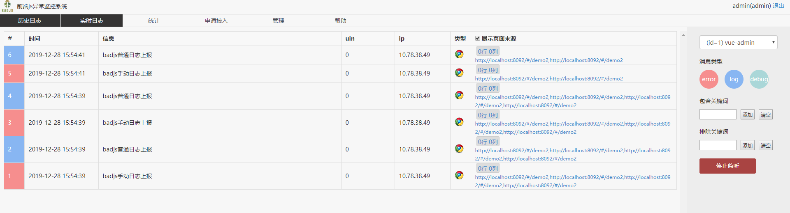

#### 4.10 启动开发

```shell
yarn dev
```

这里，读取 mock 接口。
<br>

#### 4.11 启动联调

```shell
yarn debug
```

这里，读取联调接口。
<br>

#### 4.12 项目部署

（1）cos 信息配置

```javascript
const $urlJoin = require('url-join')
// 使用 COS 的域名，以//开头，自动匹配站点协议
config.cdnBase = '//cdn.xx.yy.com'
// COS 上传的路径
config.uploadUrl = '/2019/test-project'
config.cdnRoot = $urlJoin(config.cdnBase, config.uploadUrl)
// COS 上传配置模板
config.uploadConfig = {
	// 在腾讯云申请的 AppId
	AppId: '',
	// 配置腾讯云 COS 服务所需的 SecretId
	SecretId: '',
	// 配置腾讯云 COS 服务所需的 SecretKey
	SecretKey: '',
	// COS服务配置的存储桶名称
	Bucket: '',
	// 地域名称
	Region: '',
	// 上传cdn的路径。所有文件上传到这个路径下
	prefix: config.uploadUrl
}
```

（2）打包

```shell
yarn build
```

（3）静态资源上传

```shell
yarn upload
```

（4）执行部署

通过 scp 等命令，将打包后的 index.html 上传到服务器。

（5）完成

<br>


### 5.功能模块详解

#### 5.1 用户权限

#### 5.1.1 用户信息管理

用户信息存放于vuex中（vuex/user.js如下）：

```javascript
export default {
	state: {
		userInfo: null,
		auth: null
	},
	mutations: {
		setUserInfo (state, info) {
			state.userInfo = info
		},
		setAuth (state, authObj) {
			state.auth = authObj
		}
	}
}
```

<br>

#### 5.1.2 权限管理

**【实现方案】**
使用 authority-filter 工具包，进行菜单、路由、页面操作，三个维度的权限控制。

<br>

**【实现代码】**

```javascript
// router/index.js
import $Auth from 'authority-filter'
import $authDic from '.model/authDict'
import $demo1 from 'demo1'
import $demo2 from 'demo2'
import $demo3 from 'demo3'
import $allMenus from '.model/menu'

// $authDic 是需要开发者自行定义的权限字典。roleId 是从 userInfo 中获取的用户角色 id
const auth = new $Auth($authDic, roleId)
// 全局存储 auth 对象（我们建议这样做。如果有页面操作权限控制需求，那么必须这样做）
$store.commit('user/setAuth', auth)
// 进行路由过滤（传入项目定义的所有路由。详见 5.2）
const routerList = auth.getRouterList([...$demo1, ...$demo2, ...$demo3])
// 生成当前用户有权访问的路由配置。其中，'/' '/home' '*' 为默认路由配置，所有用户皆有权限访问
router.addRoutes([
	...routerList,
	{
		path: '/',
		redirect: '/home'
	},
	{
		path: '/home',
		component: $home
	},
	{
		path: '*',
		component: $notFound
	}
])
// 进行菜单过滤（传入项目定义的所有菜单。详见 5.2）
const menuList = auth.getMenuList(allMenus)
// 全局存储 menuList（这里全局存储，在生成菜单时，就可以通过vuex访问到menuList数据）
$store.commit('menu/setMenu', menuList)
```

关于 authority-filter 的详细说明，请参照：[authority-filter](https://www.npmjs.com/package/authority-filter "authority-filter")

<br>

#### 5.1.3 两种不同登录场景的逻辑说明（第三方登录/本系统登录）

##### 1. 第三方登录

（1）整体流程

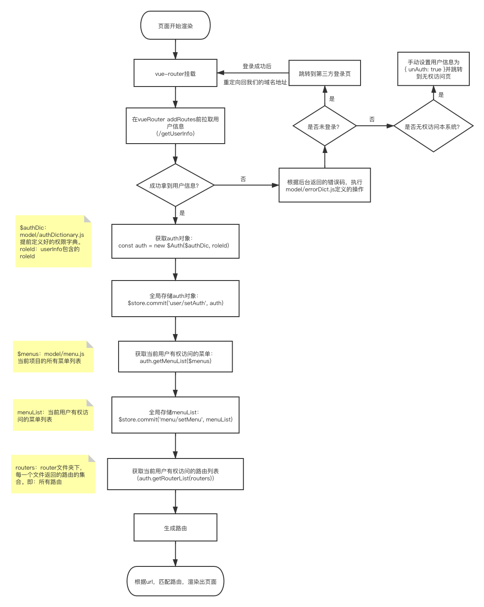

<br>

（2）核心逻辑说明

页面初始化时，首先拉取用户信息。
用户信息拉取成功，说明当前用户已登录、登录未过期，且有权访问本系统。
用户信息拉取失败，后台会返回约定好的错误码。对于错误码的响应，可定义在 model/errorDict.js 中。

脚手架默认响应：
1）未登录/登录过期：
弹窗提示用户未登录，2秒后，跳转到开发者指定的第三方登录地址。
2）无权访问本系统：
返回自定义标识对象 { unAuth: true }。

router/index.js 路由生成逻辑：
1）已登录、有权访问用户：
根据 roleId 进行菜单、路由过滤。过滤后，生成可访问的菜单、路由。

2）已登录、无权访问用户：
生成 unAuth 页面路由，并将所有路由访问重定向到 unAuth 页面。
将 model/errorDict.js 执行的响应结果 { unAuth: true }，作为当前用户的 userInfo 存入 vuex。
页面通过 vuex 拿到 userInfo，确定当前用户是否有权访问，从而决定是否渲染菜单栏。

<br>

##### 2.本系统登录

（1）整体流程

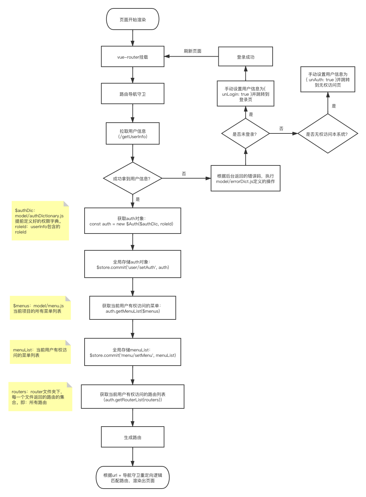

<br>

（2）核心逻辑说明

在每次路由跳转前，添加导航守卫。
导航守卫根据 /getUserInfo 返回的用户信息，确认当前用户登录及权限，从而确定渲染哪一个页面。

用户信息拉取成功，说明当前用户已登录、登录未过期，且有权访问本系统。根据当前用户的 roleId，过滤、生成有权访问的菜单列表、路由列表。
用户信息拉取失败，后台会返回约定好的错误码。对于错误码的响应，可定义在 model/errorDict.js 中。

脚手架默认响应：
1）未登录/登录过期：
返回自定义标识对象 { unLogin: true }。
2）无权访问本系统：
返回自定义标识对象 { unAuth: true }。

导航守卫逻辑：
1）当前未登录（{ unLogin: true }）：所有页面访问重定向到 login.vue
2）当前已登录、无权访问（{ unAuth: true }）：除 login.vue 正常访问，其他所有页面访问，重定向到 unAuth .vue
3）当前已登录、有权访问：访问 login.vue / unAuth.vue 重定向到 /，其他所有页面正常访问

<br>

#### 5.2 菜单&路由&页面

#### 5.2.1 菜单的设计

定义位置：model/menu.js 👇

```javascript
const menus = [
	{
		title: '操作过滤',
		icon: 'clock',
		url: '/demo1'
	},
	{
		title: '工具示例',
		icon: 'gear',
		submenu: [
			{
				title: '使用示例',
				url: '/demo2'
			}
		]
	},
	{
		title: '组件示例',
		icon: 'clock',
		submenu: [
			{
				title: '数据管理',
				icon: 'clock',
				submenu: [
					{
						title: '数据列表',
						url: '/demo3'
					}
				]
			}
		]
	},
]

export default menus

```

**【注意】**
根据我们的设计，**菜单的 url，应该只有一层**。即：定义为/demo，而非/demo/list。

**这一层，作为一个命名空间。它之下的所有路径，对应这个菜单下的二级、三级...n级页面。**
比如，/demo 是一个菜单页，类型为列表页。包含编辑、详情按钮。从这个入口进入的编辑、详情页，对应的路由，应该形如：/demo/edit、/demo/detail。
这样，我们就可以根据路由的“命名空间”，确定菜单栏中的哪一个菜单，显示为高亮选中。

<br>

#### 5.2.2 路由的设计

项目中所有路由，统一放在 router 文件夹下。
router下的每一个路由文件，**与菜单页一一对应**。也就是，**与命名空间一一对应**。
每一个路由文件内，定义当前菜单页、以及它下属的二级、三级......n级页面的所有路由。
在入口文件 router/index.js 中，引入 vue-router，和所有的路由文件。同时，根据当前登录用户权限，动态生成可访问的路由文件。

例如：
有菜单页/demo1，命名空间为demo1，则应有一个router/demo1.js，内容形如：

```javascript
const pages_demo1_detail = () => import('pages/demo1/detail.vue')
const pages_demo1_edit = () => import('pages/demo1/edit.vue')
const pages_demo1_list = () => import('pages/demo1/list.vue')

const routerList = [
	{
		path: '/demo1/detail',
		component: pages_demo1_detail
	},
	{
		path: '/demo1/edit',
		component: pages_demo1_edit
	},
	{
		path: '/demo1',
		component: pages_demo1_list
	}
]

export default routerList
```

<br>

#### 5.2.3 页面的管理

所有页面，统一存放在 pages 文件夹下。
按照我们的设计，**pages 下的每一个文件夹，对应一个菜单页**，内部存放菜单页.vue文件，和它下属的所有二级、三级......n级页面。那些既不是菜单页，又不是菜单页下属页面的页面，如 home 页、notFound 页，直接存放在 pages 下。

**这里需要注意：菜单页对应的页面，我们规定命名为 index.vue / list.vue。**

如果你的 pages 目录结构，遵从我们的规范，当你使用我们提供的 yarn route 命令，我们会为你全自动生成 router 文件夹下的所有路由文件。

当然，这里的规范要求，目前只有两点：
（1）pages 下的每一个文件夹，要对应一个菜单页。这个文件夹的名字，会成为菜单页的路由，也就是命名空间。
（2）菜单页对应页面的命名，只能是 index.vue / list.vue。

除此之外，你可以完全按照自己的意愿，去管理页面。
**请注意，我们只会生成不直接存放于 pages 下的页面对应的路由文件。**

那些直接放在 pages 下的页面，如 home.vue，我们选择在 router/index.js 中手动配置。
一来，因为这样的页面并不会太多。二来，这样的页面，通常不存在访问权限的问题，所有人皆可访问，不需要参与路由过滤。同时，如匹配'*'的notFound页，是有定义顺序要求的，一定要放到路由定义的最后，才可以防止错误匹配与跳转。因此，更适合手动管理。

<br>

#### 5.3 接口调用 —— mixin/request.js

#### 5.3.1 使用demo

```html
<!-- list.vue -->
<template>
	我是列表页
</template>

<srcipt>
export default {
	data() {
		return {
			list: ''
		}
	},
	mounted() {
		this.$get('/getList', { age: 25 }).then(res => {
			console.log('res:', res)
			this.setData()
		})
	}
}
</srcipt>
```

<br>

#### 5.3.2 支持功能

| 方法 | 调用方式 |
| ------------ | ------------ |
| $get | this.$get(url, params).then(rs => console.log('res:', res)) |
| $post | this.$post(url, params).then(rs => console.log('res:', res))|
| $put | this.$put(url, params).then(rs => console.log('res:', res))|
| $delete | this.$delete(url, params).then(rs => console.log('res:', res))|
| $request | this.$request({ method: 'get', params: { test: 100 } }).then(rs => console.log('res:', res))|

【注】
所有方法，均支持在.vue中直接使用this调用。
如果需要在js中使用，手动import即可。import { $get, $request } from '@/mixin/request'

<br>

#### 5.3.3 请求错误处理

对于请求错误的处理，我们设计了错误字典：model/errorDict.js。

它看起来像这样：

```javascript
export default {
	/** key: httpCode
	 *   value: 指定错误码，对应的前端响应。如果是方法，直接执行。如果是string，弹窗提示
	 */
	403: () => location.href = 'http://mp.weixin.qq.com',
	404: '啊哦，404了',
	200: {
		// key: 服务器定义的code，value：同上
		3000: '服务器返回了一个3000',
		3005: () => location.href = 'https://open.work.weixin.qq.com/wwopen/sso/qrConnect?appid=APPID&agentid=AGENTID&redirect_uri=REDIRECT_URI&'
	}
}

```

开发者可以通过配置 errorDict，指定错误码对应的响应或提示语。

我们在request.js中使用了拦截器，处理errorDict中定义的响应。你可以放心地将所有错误处理，统一配置在这个字典中。除此之外，只专注于数据正确响应的逻辑开发即可。

<br>

#### 5.4 日志监控模块 —— Badjs

#### 简介

Badjs是腾讯开源的一站式前端监控解决方案，涵盖了日志上报，错误监控，性能监控，资源测速等功能。
主要提供基础数据的上报，支持无打点首屏测速、无侵入式资源测速、CGI测速、白名单机制、离线日志等先进特性。
通过自动监控前端错误，在错误发生时上报错误的具体情况，协助开发者快速定位问题。

#### 优势


- 一站式体系化解决方案：业务只需要简单的配置，引入上报文件，即可实现脚本错误上报，每日统计邮件跟踪方便。
- 可视化查询系统，快速定位错误信息：web应用程序脚本数量庞大，开发人员在如此之多的脚本中定位某个问题变得困难。BadJS能够巧妙定位错误脚本代码，进行反馈。通过各种查询条件，快速找到详细错误日志。
- 跨域、Script Error等棘手问题不再是难题：tryjs帮你发现一切。
- 真实用户体验监控与分析：通过浏览器端真实用户行为与体验数据监控，为您提供JavaScript、AJAX请求错误诊断和页面加载深度分析帮助开发人员深入定位每一个问题细节。即使没有用户投诉，依然能发现隐蔽bug，主动提升用户体验。
- 用户行为分析：细粒度追踪真实的用户行为操作及流程，前端崩溃、加载缓慢及错误问题，可关联到后端进行深度诊断。
- 产品质量的保障：浏览器百花齐放，用户环境复杂，巨大的差异导致开发人员难以重现用户遇到的问题。无法像后台一样上报所有用户操作日志。通过BadJS，上报用户端脚本错误，为产品质量保驾护航。

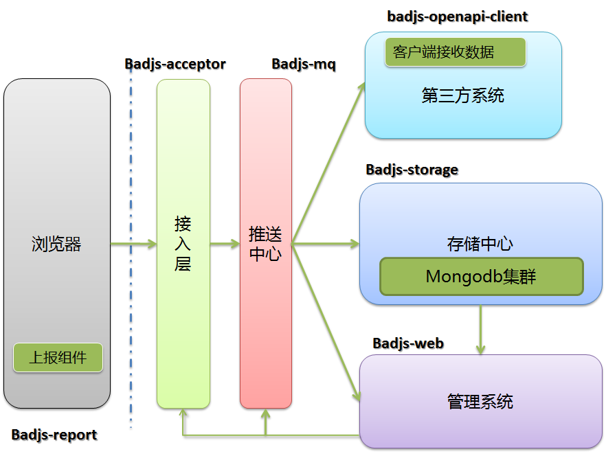


#### 5.4.1 使用demo

##### 初始化

打开全局开关

在config.js中配置

```javascript
config.logReport = true
```

初始化Badjs实例

```javascript
const bjReport = badjs.init({
    id: 'xxx',                               // 上报 id, 不指定 id 将不上报
    delay: 1000,                          // 延迟多少毫秒，合并缓冲区中的上报（默认）
    url: "//{your server ip}/badjs",         // 指定上报地址
    ignore: [/Script error/i],            // 忽略某个错误
    random: 1,                            // 抽样上报，1~0 之间数值，1为100%上报（默认 1）
    repeat: 5,                            // 重复上报次数(对于同一个错误超过多少次不上报)
    onReport: function (id, errObj) {
        console.log(id, errObj)
    },     // 当上报的时候回调。 id: 上报的 id, errObj: 错误的对象
    submit: null,                         // 覆盖原来的上报方式，可以自行修改为 post 上报等
    ext: {},                              // 扩展属性，后端做扩展处理属性。例如：存在 msid 就会分发到 monitor,
    offlineLog: false,                   // 是否启离线日志 [默认 false]
    offlineLogExp: 5,                    // 离线有效时间，默认最近5天
});

```

将reportApiSpeed和reportAssetSpeed配置为true时，Badjs 将会自动收集页面的API、静态资源请求状况，并上报至 Badjs 后端服务。


#### 5.4.2 分级上报

###### info级别上报

```javascript
this.$bjReport.logI('Badjs普通日志上报', report)
```

上报info 等级的日志，不会影响 Badjs 评分，也不会触发 Badjs 告警。非常适合上报关键路径信息，当问题发生时，可以配合快速定位复现路径。

###### 日志实时上报

```javascript
this.$bjReport.logD('Badjs实时日志上报', report)
```

可以结合实时上报，跟踪问题; 不存入存储

###### 上报错误日志

```javascript
this.$bjReport.report('Badjs异常日志上报', report)
```

上报error等级的日志，往往意味着页面出现了错误，当上报的 error 日志达到阈值时，Badjs 将会进行告警，帮助开发者尽早发现问题。另外，Badjs 每天都会给所有项目打分，上报的 error 日志数量是一个关键指标。


###### 离线日志上报

```javascript
this.$bjReport.offline('Badjs离线日志上报', report)
```
记录离线日志


更多信息，可阅读Badjs官网：[https://github.com/BetterJS/doc](https://github.com/BetterJS/doc "https://github.com/BetterJS/doc")
<br>

#### 5.5 前后端分离 —— mock支持

我们提供了，使用在线mock/本地mock，两种mock方式，你可以按需选择。

开始使用前，请在 config.js 中设置 config.mock = '在线mock域名地址/127.0.0.1:3001'。
（我们提供的本地mock，默认启动在3001端口）

<br>

#### 5.5.1 在线mock

【配置Demo】

```javascript
// config.js
config.mock = 'https://www.fastmock.site/mock/5804566cbf92cb32bf29b622fdfe6138/word'
```

我们以使用 fastmock 为例，mock了脚手架的demo数据。
fastmock 官网传送门：[https://www.fastmock.site](https://www.fastmock.site/#/)

<br>

#### 5.5.2 本地mock

【配置Demo】

```javascript
// config.js
config.mock = 'http://127.0.0.1:3001'
```

【说明】
本地mock，使用json-server。

【mock目录结构】

```javascript
├── data                    // 存放mock数据
|  ├── fail                  // 模拟调用失败的mock数据
|  |  └── demo1
|  |     ├── edit.json
|  |     └── list.json
|  └── success           // 模拟调用成功的mock数据
|     └── demo1
|        ├── edit.json
|        └── list.json
├── db.js                    // 用于生成mock数据结构
├── mock-server.js      // 服务启动入口
```

【使用方式】

**step1：根据接口 url 层级，创建 mock 用 json 文件**
例如：接口 url 为 /demo1/list
创建模拟请求成功的mock文件：/mock/data/success**/demo1/list.json**
创建模拟请求失败的mock文件：/mock/data/fail**/demo1/list.json**

**step2：统一在 api.js 进行接口配置**
模拟请求成功，直接使用真实接口：const API = { list: '/demo1/list' }
模拟请求失败，改造真实接口为：const API = { list: '**/fail**/demo1/list' }

**step3：页面中使用真实的接口请求逻辑**

```javascript
import $api from '@/model/api.js'
this.$get($api.list).then(res => { console.log('res:', res) })
```

<br>

关于json-server的具体设计方案，详见：[https://www.jianshu.com/p/2b18352b49d1](https://www.jianshu.com/p/2b18352b49d1)

<br>

#### 5.6 实用工具

#### 5.6.1 页面创建：pageCreate

【使用方式】

```shell
yarn page
```


<br>

效果如图：


<br>

#### 5.6.2 路由自动生成：routeCreate

【使用方式】

```shell
yarn route
```


我们支持全覆盖式路由创建、附加式路由创建，两种选择。

<br>

#### 5.7 静态资源管理
#### 5.7.1 公共库

我们对项目中使用到的公共库，进行了 webpack 的 externals 化。
使用 cdn 资源引入这些库，可以有效减小项目打包后的代码体积。

如果你添加了额外的公共库，并且也希望使用cdn资源引入，而不是将它们打包到项目代码中，那么你应该在 config.js 中进行相应的配置，修改 externals 属性。

我们内置的 externals 看起来像这样：

```javascript
// 版本库外部引入文件路径
config.externals = [
	{
		path: '/vue/2.6.10/vue.js',
		packageName: 'vue',
		variableName: 'Vue'
	},
	{
		path: '/vuex/3.1.2/vuex.js',
		packageName: 'vuex',
		variableName: 'Vuex'
	},
	{
		path: '/element-ui/2.12.0/theme-chalk/index.css'
	}
]
```

所用 cdn 资源，均来自 [https://lib.baomitu.com](https://lib.baomitu.com "https://lib.baomitu.com")

方便起见，你需要的公共库，记得也去这里查找哦 😉

<br>

#### 5.7.2 图片与公共样式

png图片、svg图片、common less文件，均存放于 assets 文件夹。

```javascript
├── assets
|  ├── css                       // 公共 css 文件
|  |  ├── color.less         // 当前项目各种设计颜色定义
|  |  └── u-demo.less     // 业务相关的公共样式示例
|  ├── icon                     // 存放所有 svg 文件
|  |  ├── clock.svg          // svg 示例
|  |  └── gear.svg          // svg 示例
|  ├── image                  // 存放所有png、jpg等大图
|  |  └── logo.png         // png 图片示例
|  └── index.js              // 静态资源（svg+css）引用入口
```
main.js 引入 assets/index.js，从而使通用样式全局生效、svg图标全局可用。

<br>

#### 5.7.3 打包后的静态资源上传cos

我们默认支持腾讯云对象（cos）存储。

【使用方式】
配置config.js：

```javascript
const $urlJoin = require('url-join')
// 使用 COS 的域名，以//开头，自动匹配站点协议
config.cdnBase = '//cdn.xx.yy.com'
// COS 上传的路径
config.uploadUrl = '/2019/test-project'
config.cdnRoot = $urlJoin(config.cdnBase, config.uploadUrl)
// COS 上传配置模板
config.uploadConfig = {
	// 在腾讯云申请的 AppId
	AppId: '',
	// 配置腾讯云 COS 服务所需的 SecretId
	SecretId: '',
	// 配置腾讯云 COS 服务所需的 SecretKey
	SecretKey: '',
	// COS服务配置的存储桶名称
	Bucket: '',
	// 地域名称
	Region: '',
	// 上传cdn的路径。所有文件上传到这个路径下
	prefix: config.uploadUrl
}
```

配置 vue.config.js（默认已配置）：

```javascript
// 使用cos存储的静态资源引用路径
const publicPath = process.env.NODE_ENV === 'production' ? $config.cdnRoot : '';
```

yarn build 打包后，执行** yarn upload **上传。

<br>

#### 5.8 开发支持

#### 5.8.1 接口管理 —— api.js

为了方便接口的管理，我们设计了统一的接口管理文件：model/api.js

它看起来像这样：

```javascript
// 统一的接口管理
const API = {
	getUserInfo: '/getUserInfo',
	getList: '/list'
}

// 如果是开发模式，为接口路径手动添加dev前缀，用于proxy代理匹配
if (document.domain.indexOf('.com') === -1) {
	Object.keys(API).forEach(key => {
		API[key] = '/dev' + API[key]
	})
}

export default API

```

我们在页面中，通过引入 API，读取 API.getUserInfo 来调用接口。

这样的设计可以保证，当后台接口路径调整，统一修改 api.js即可。便于接口维护。

<br>

#### 5.8.2 命令行启动，模式区分设计

我们提供了两种启动模式：**开发模式 / 联调模式**。

每种模式启动，都会自动生成 model/env.js 文件，并写入当前模式下的接口调用域名，如：

```javascript
// @param:domain 启动后切换环境后生成的域名
const env = {};
env.domain = "https://www.fastmock.site/mock/cfbff5d79bd9ff49a81e04dde80521e3/admin";
module.exports = env;
```

<br>

（1）开发模式启动，调用 mock 接口

```shell
yarn dev
```

mock 地址，请在 config.js 中自行配置：

```javascript
config.mock = 'https://www.fastmock.site/mock/cfbff5d79bd9ff49a81e04dde80521e3/admin'
```

<br>

（2）联调模式启动

```shell
yarn debug
```

联调服务器地址，mock 地址，请在 config.js 中自行配置：

```javascript
config.debug = 'http://10.12.13.1:8000'
```

<br>

#### 5.8.3 本地联调代理配置

如上 5.8.1 所示，我们在创建 api.js 时，会检测当前启动页面的域名。如果不是在包含 .com 的域名下启动，则认为是开发环境。我们手动为开发环境下的接口都添加了 /dev 前缀，同时，在 vue.config.js 中进行代理配置，从而解决联调场景下，localhost 发送的请求，被服务器判定为跨域，拒绝访问的问题。

vue.config.js 配置如下：

```javascript
devServer: {
	port: $config.devServerPort,
	proxy: {
		'/dev': {                            // 匹配带有/dev 前缀的请求
			target: $env.domain,    // 根据启动模式，动态设置代理到的目标域名
			changeOrigin: true,
			pathRewrite: {
				'^/dev': ''
			},
			logLevel: 'debug'
		}
	}
}
```

<br>

如果你使用的公司内网，访问外部网站需要走代理。那么，在这里，你可能还需要进行一个配置，才可以成功拿到如 fastmock 这样的外部网站，返回的数据。

```javascript
// vue.config.js
const HttpsProxyAgent = require('https-proxy-agent')
// 【注意】请在本地，设置环境变量 HTTP_PROXY = '你的公司内网访问外部的代理服务器地址'
const proxyServer = process.env.HTTP_PROXY;

devServer: {
	port: $config.devServerPort,
	proxy: {
		'/dev': {                            // 匹配带有/dev 前缀的请求
			target: $env.domain,    // 根据启动模式，动态设置代理到的目标域名
			// 解决内网代理问题。（如不需要代理，请删除以下agent代码）
			agent: new HttpsProxyAgent(proxyServer),
			changeOrigin: true,
			pathRewrite: {
				'^/dev': ''
			},
			logLevel: 'debug'
		}
	}
}
```

<br>

#### 5.9 规范代码

#### 5.9.1 .eslintrc 与 .editorconfig

我们制定了这款脚手架默认的开发规范，并为它配置了配套的 .editorconfig 格式化。如果你使用了 vscode 这样的编辑器，并安装了 editor 插件，你的代码会根据我们提供的 .editorconfig 自动格式化。
当然，你也可以自定义属于你们团队的代码规范。

<br>

#### 5.9.2 .pre-commit 检查

为了保证提交代码的规范性，我们在 package.json 中配置了 pre-commit 检查。在你执行 git commit 的时候，自动执行代码规范性检查，检查通过的代码，才可以成功提交，如此，进一步控制了代码的规范性。

<br>

## · 管理端-react（开发中）

## · 小程序-原生（开发中）

## · 小程序-taro（开发中）

## · 小程序-wepy（开发中）

## · 移动端-vue（开发中）

## · 移动端-react（开发中）

## · NodeJS-koa（开发中）

## · NodeJS-express（开发中）

## · 组件工具-原生js（开发中）

## · 组件工具-vue组件（开发中）

## · 组件工具-react组件（开发中）
